# 📱 Mobile Application Design Tracker Sheet

Welcome to the **Mobile Application Design Tracker Sheet**, a personal Flutter learning repository where I solved 19 practical Flutter & Dart UI problems while learning and experimenting with mobile app development.

Each problem helped me understand and practice a fundamental aspect of Flutter development — from basic UI components to animations, dark mode toggling, and media uploading.

---

## 🚀 What I Learned

Here's a breakdown of the problems I solved:

1. 👋 **Hello Flutter** – Basic app showing "Hello Flutter" text.
2. 🔘 **Buttons Practice** – Created various styled buttons.
3. 🧭 **Drawer and AppBar** – Implemented navigation drawer and AppBar.
4. 📱 **Multiple Screens** – Created multiple pages with navigation buttons.
5. 📲 **Navigation Through Pages** – Used `Navigator` to move between screens.
6. 📜 **ListView Demo** – Displayed items using `ListView`.
7. ✍️ **Text Styling Samples** – Practiced with `TextStyle`, fonts, and alignment.
8. 🔐 **Login Page UI** – Built a clean login screen layout.
9. 🖼️ **GridView for Pictures** – Showed pictures in a responsive grid.
10. 🛍️ **Product Cards UI** – Designed simple product card layouts.
11. 🌐 **Online Image Loading** – Loaded images from the internet.
12. 📁 **Local Image Display** – Displayed images from device assets.
13. 🧹 **Swipe to Reveal Actions** – Added swipe-to-edit/delete functionality.
14. 📆 **Date & Time Picker** – Implemented date and time picking.
15. 🔄 **Animated Container** – On button press, a container changes shape & color randomly.
16. 🌙 **Dark Mode Toggle** – Switched themes using a button.
17. 📤 **Image Picker from Device** – Selected and displayed images from user's gallery.
18. 🔄 **Interactive Shape Generator** – Random animated shape and color changes on button press.
19. 💡 **State Management Practice** – Used `setState` to manage simple UI updates.

---

## 🖼️ Preview

<table>
  <tr>
    <td>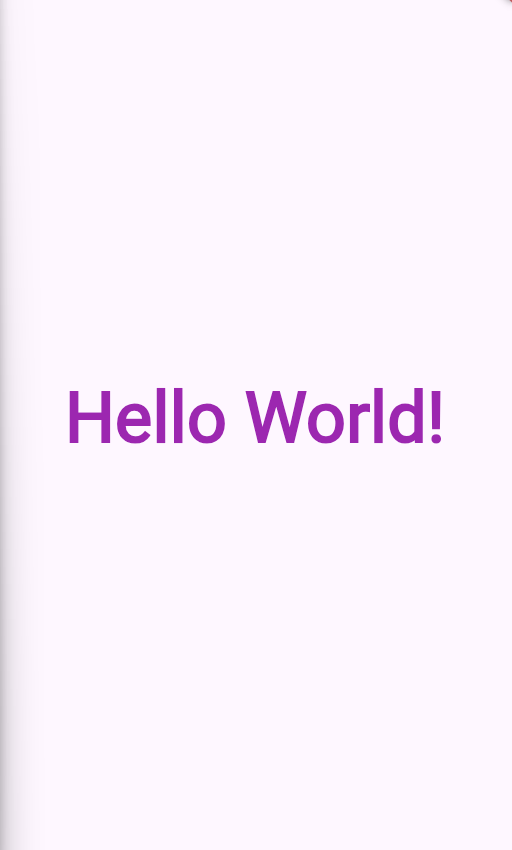 
1
</td>
    <td>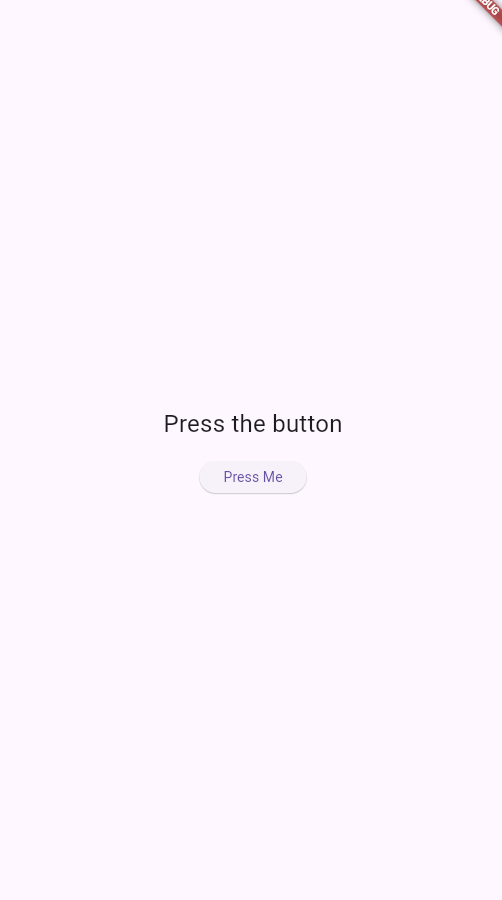 
2
</td>
    <td>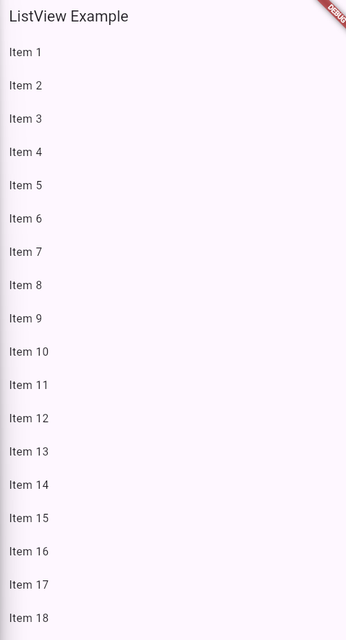 
3
</td>
    <td> 
4
</td>
    <td>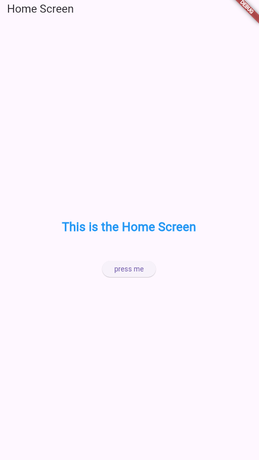 
5
</td>
  </tr>
  <tr>
    <td>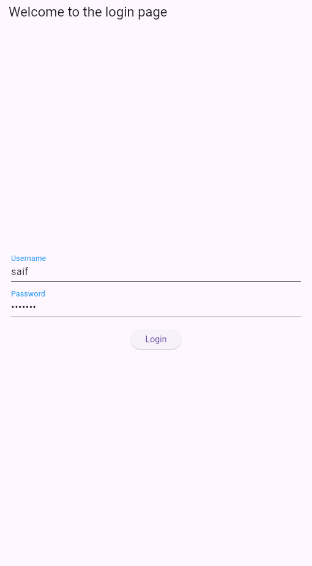 
6
</td>
    <td>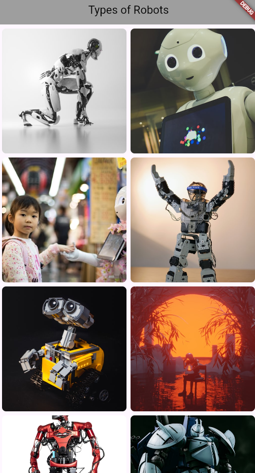 
7
</td>
    <td> 
8
</td>
    <td>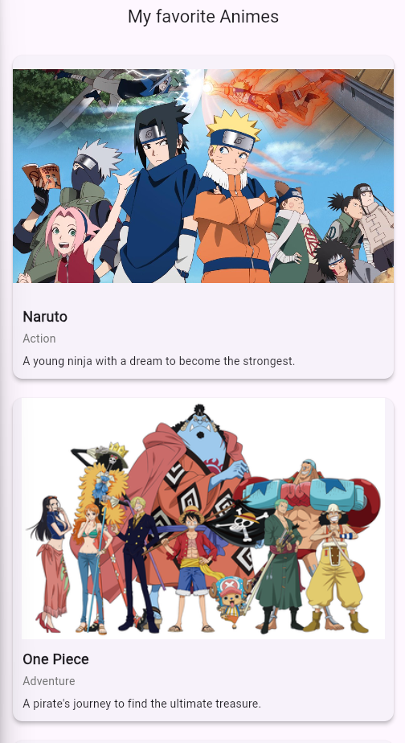 
9
</td>
    <td>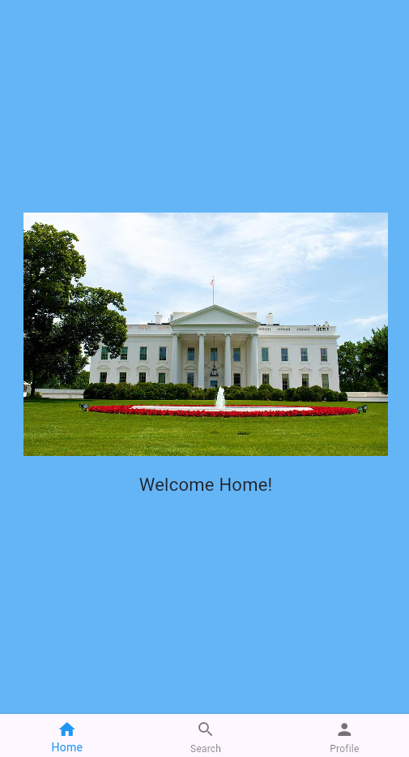 
10
</td>
  </tr>
  <tr>
    <td> 
11
</td>
    <td>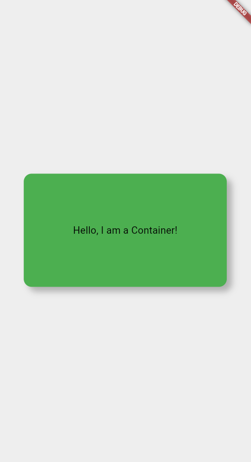 
12
</td>
    <td>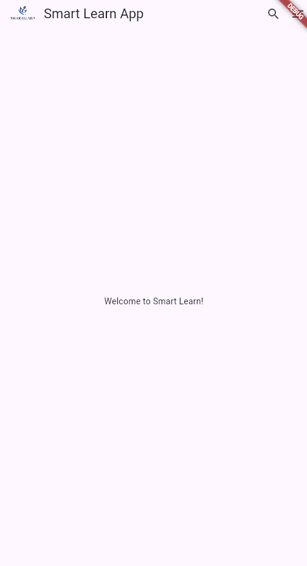 
13
</td>
    <td>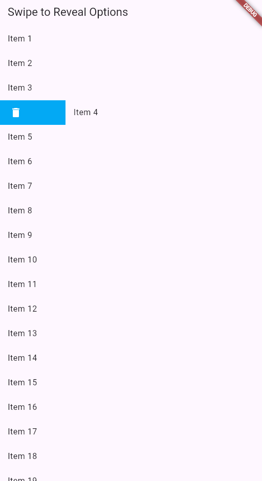 
14
</td>
    <td>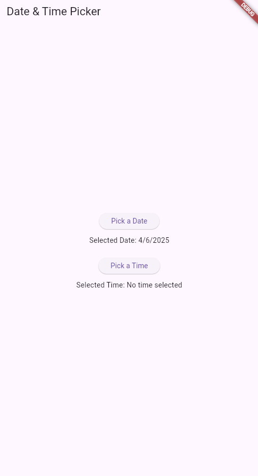 
15
</td>
  </tr>
  <tr>
    <td>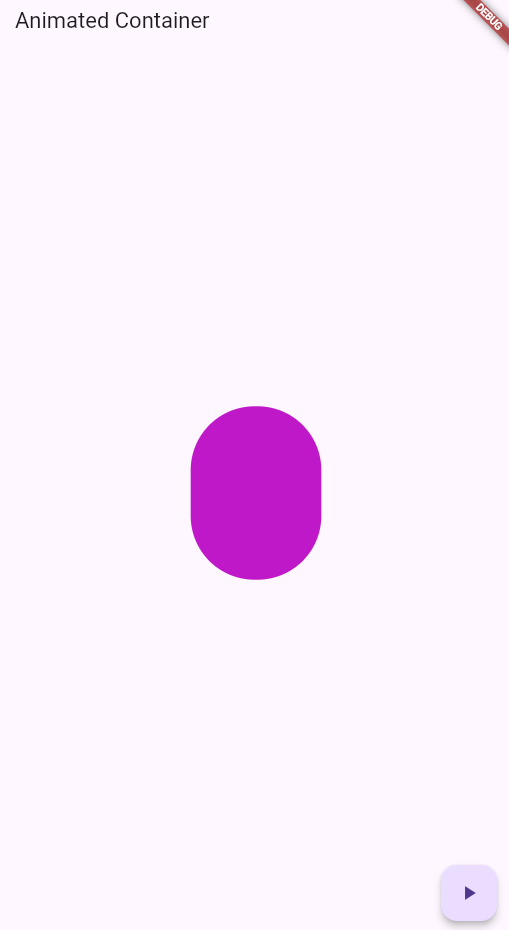 
16
</td>
    <td>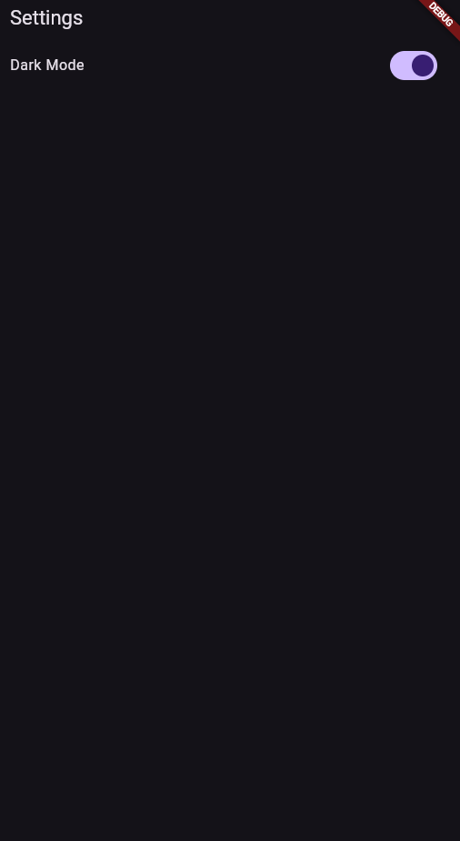 
17
</td>
    <td>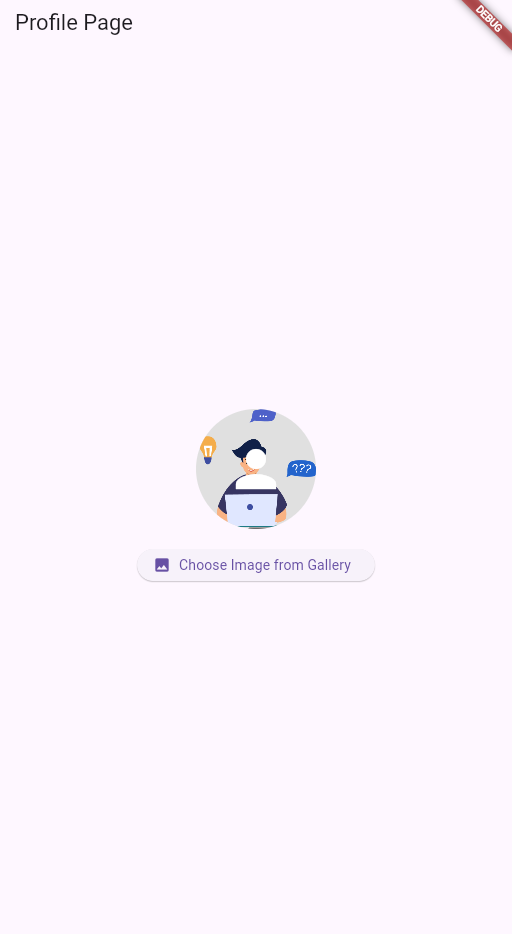 
18
</td>
    <td>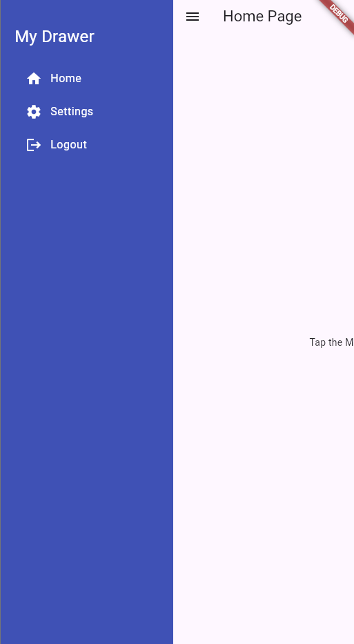 
19
</td>
  </tr>
</table>

---

## 🧑‍💻 Tech Stack

- Flutter
- Dart
- Visual Studio Code

---

## 📬 Contact

If you'd like to collaborate or have any feedback, feel free to reach out via [GitHub Issues](https://github.com/saif-pain/mad_tracker_sheet/issues).

---

🌟 **Don’t forget to give this repo a star if you found it helpful!**
